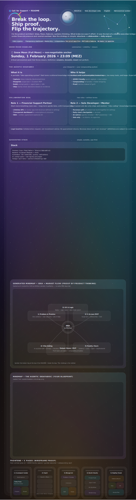

  

---

# Call for Support  
**Two partners. One turnaround. Proof, not promises.**

🌕 **Deadline:** **Sunday, 1 February 2026 — 23:09 (MEZ)**  
🔒 **NDA-first**  
👤 **Solo developer only**  
🌍 **NL / EN**

---

## Executive summary

This repository documents a **real, time-bound turnaround effort**.

I am looking for **exactly two people**:
1. **One Financial Support Partner**
2. **One Solo Developer / Mentor (AI-native)**

Together, we ship **two proof apps** before the deadline — not perfect, but **complete, showable, and real**.

This README contains:
- the full story  
- the deal structure  
- the app architecture  
- userflows  
- and the plan to the deadline  

No hype. No shortcuts. Only execution.

---

## The story (context)

For months, I pushed myself to the limit trying to make my ideas tangible.

I did not underestimate app building.
I respected it — and paid the price.

What accumulated:
- Chats full of app ideas and feature concepts  
- Raindrops full of tutorials and research  
- 90+ repositories with broken or unfinished code  
- Scattered data, notes, and experiments  

What was missing was **not motivation**, but:
- structure  
- guidance  
- breathing room  

Financial pressure + lack of an execution bridge led to mental exhaustion.

What can save this situation now is **visible result**.

---

## My real talent

My strength is **architectural thinking**:
- app concepts  
- feature systems  
- flows and extensions  
- fast, deep ideation  

Brainstorming with AI makes this **exponential**.

I am the **architect**.

What I need is the **bridge**:
> from blueprint → shipped product

---

## Positioning (what this is NOT)

This is **not**:
- a “get rich quick” idea  
- an “AI will build everything” fantasy  
- a beginner underestimating complexity  

I’ve already paid the cost — financially and mentally.

This is a **serious collaboration request**, with:
- written agreements  
- transparency  
- trust as a baseline  

---

## The symbolic quartet

The leverage happens when four forces align:

- **Me** — vision, ideation, architecture  
- **Solo developer** — execution + mentorship  
- **Financial partner** — focus and stability  
- **AI** — acceleration and leverage  

Together, this turns chaos into compounding output.

---

## The deal

### Role 1 — Financial Support Partner

Purpose: **temporary financial breathing room** → long-term upside.

What you receive:
- **20% lifetime share** on every app I bring to market  
  (net revenue defined in writing)
- **Transparent revenue dashboard**
- Optional repayment-first structure
- NDA + written agreement (optionally JV)

This is **not investment advice** and comes with **no guaranteed returns**.

---

### Role 2 — Solo Developer / Mentor

I am explicitly **not** looking for a team or agency.

I’m looking for **one trusted solo developer** who:
- is AI-native  
- understands agentic workflows  
- works with MCP concepts  
- builds with n8n workflows  
- enjoys vibe coding  

The goal is **mentorship → independence**.

What you receive:
- **Revenue split per app** we actively build together  
- Clear scope, written agreement  
- Long-term collaboration if alignment is strong  

---

## Two apps = proof

I do not need ten apps.

I need **two**.

### 1) Lifemanagement stack
Minimal workflows to:
- regain structure  
- reduce mental load  
- stabilize daily execution  

Without this, everything becomes monnikenwerk.

---

### 2) IdeaFabric
A portable ideas system (Expo-based):
- capture ideas anywhere  
- structure and iterate  
- centralize docs, chats, tutorials  
- turn chaos into a **data vault**

This is the compounding engine.

---

## Call for Support app (this repo)

### Purpose
A mobile-first funnel that:
- communicates the story clearly  
- filters noise  
- enforces NDA-first  
- selects exactly two partners  

---

### Structure & routes

---

### Recommended stack

- **Frontend:** Next.js or Vite + Tailwind  
- **Backend:** Supabase  
- **Automation:** n8n workflows  
- **Payments:** Wise (now), Stripe (later)  

---

## Userflows

### Developer flow
- Landing → Roles → Developer  
- NDA → Apply  
- Shortlist → Call  
- Written agreement → Ship  

---

### Finance flow
- Landing → Roles → Finance  
- NDA → Apply  
- Optional Wise support  
- Agreement → Dashboard access  

---

### Non-negotiables
- Solo developer only  
- NDA before details  
- Respect, empathy, trust  
- MVP first, features later  

---

## Deadline plan

🌕 **Sunday, 1 February 2026 — 23:09 (MEZ)**  
(Full Moon / Snow Moon — culmination, not beginning)

### Definition of Done
Not perfect. **Complete. Showable. Closed.**

- Support app live  
- IdeaFabric v1 demo-ready  
- Lifemanagement v1 operational  

---

### Phases
1. **Stabilize** — lock scope, stop tool-hopping  
2. **Define MVP** — clear “done”  
3. **Build** — daily visible output  
4. **Close** — freeze, test, demo  

---

## Legal & transparency

- This is **not investment advice**
- No guaranteed returns
- All revenue shares defined in writing
- NDA required before sensitive details

---

## Final note

I’m not asking to be saved.  
I’m asking to **collaborate**.

My brain is not a liability — it’s a lever,  
**if structured correctly**.

If you are a:
- Financial Support Partner  
- or a Solo Developer / Mentor  

and you value clarity, trust, and building something real:

**This is the moment.**

🌕 **Deadline: 1 February 2026 — 23:09 (MEZ)**  
Complete. Showable. Closed.